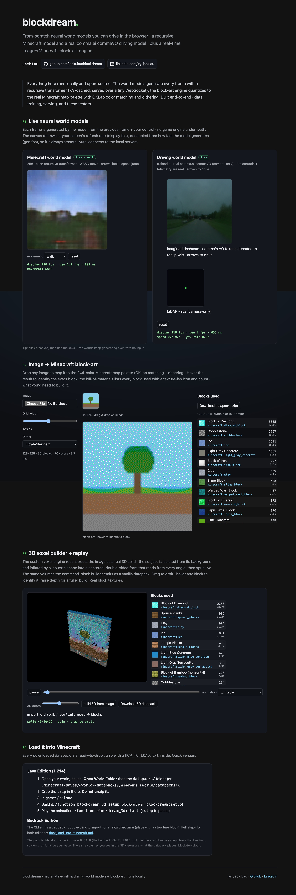

# blockdream

Neural world models of Minecraft that you can **play** - in the browser *and* inside
**vanilla Minecraft itself** - plus a block-art renderer that turns images, GIFs and videos
into native Minecraft builds. An action-conditioned autoregressive world model (all 9 movement
types trained on genuine real footage), a latent-diffusion track exported to ONNX for a
server-free in-browser engine, and a separate driving world model share one ML core; the
renderer colour-matches in OKLab and emits maps, structures, datapacks and behaviour packs
for **both Java and Bedrock**, in 2D walls and real 3D voxel builds with animation.



## Play it in Minecraft

You do **not** need Fabric - or any mod - to put the neural world model inside Minecraft.
Full guide, honest FPS numbers and security notes: [docs/play-without-fabric.md](./docs/play-without-fabric.md).

**Offline cast (no mods, one command).** Roll the skill-conditioned world model and emit a
vanilla Java datapack that plays the dream on a block wall in-world:

```bash
bash scripts/cast.sh                            # walk, 24 steps → /tmp/blockdream-cast/blockdream.zip
bash scripts/cast.sh --skill elytra --steps 48  # any of the 9 movement skills
```

Drop the resulting `blockdream.zip` into any vanilla Java 1.21.x world's `datapacks/` folder,
then in-game: `/reload` → `/function blockdream:setup` → `/function blockdream:start`.
The script preflights the venv / ffmpeg / checkpoint (see [Quickstart](#quickstart-fresh-clone))
and tells you exactly what's missing.

**Live cast (no mods, no datapack, your movement drives the model).** Drop into a world that
is already running and watch the dream stream onto a block wall *in place* - a sidecar owns the
socket (vanilla can't), polls a stock server's pose over RCON, and repaints the wall with the
model's predicted frames, steered by *your* movement. One command in a third terminal:

```bash
bash scripts/vanilla-server.sh                  # 1. throwaway vanilla server (localhost-only, prints the RCON password once)
bash ml/scripts/serve_demo.sh                   # 2. the world-model server (ws://127.0.0.1:8765)
bash scripts/cast-live.sh --rcon-pass <pass>    # 3. the live cast (--setup clears the wall in-world; no datapack, no /reload)
```

Honest expectations: a pool of RCON connections (`--rcon-conns`) paints each frame
concurrently so the sidecar isn't the bottleneck, leaving the rate **model-bound at ~2 fps**
for the AR checkpoint - genuinely live, genuinely mod-free, not smooth video. The full
transport + frame-rate story: [docs/live-cast.md](./docs/live-cast.md); setup + security:
[docs/play-without-fabric.md](./docs/play-without-fabric.md).

**Cast your OWN image or build (live).** The same RCON transport paints *your* content, not only the
world model. `cast-asset.sh` streams a picture, GIF, or 3D build into a running world, placed where you
choose, with no datapack and no `/reload`:

```bash
bash scripts/cast-asset.sh --image logo.png  --rcon-pass <pass> --origin 100,70,-20 --facing east --setup
bash scripts/cast-asset.sh --build photo.png --rcon-pass <pass> --depth 12 --setup                 # a 3D build
bash scripts/cast-asset.sh --build logo.png  --rcon-pass <pass> --animate spin --loops 0 --setup   # spinning 3D
bash scripts/cast-asset.sh --build clip.mp4  --rcon-pass <pass> --depth 8 --fps 6 --loops 0 --setup # a video as a live 3D animation
```

**You designate the placement** - `--origin x,y,z` (coordinates), `--facing north|south|east|west`
(direction), and `--animate spin|explode|wave|buildup` (animation): the same controls the offline
datapack and Bedrock `.mcstructure` builders take, so a build lands where, facing which way, and moving
how you ask - whether baked or cast live. `--image` paints a flat wall; `--build` a 3D build. A GIF or
video animates either way: as a moving 2D wall (`--image`) or as a **real-content 3D animation** -
every frame its own build (`--build`). Details: [docs/live-cast.md](./docs/live-cast.md).

**Fabric mod (the high-FPS alternative).** Want smooth video instead? The optional
[Fabric mod](./mods/java-fabric/README.md) swaps each map's colour array per tick - real
video on an item-frame map wall (up to ~20 fps), with the same live world-model control:

```bash
bash scripts/fabric-install.sh    # JDK 21 preflight, builds the jar, prints install steps
```

## Quickstart (fresh clone)

```bash
git clone https://github.com/jackulau/blockdream && cd blockdream
pnpm install
pnpm -r --filter "./packages/**" build   # block-art renderer + CLI work right away, no ML needed
```

The trained ML checkpoints are **not in the repo** (gitignored, like all of `ml/runs/`) -
they ship as assets on the [v0.1.0 GitHub release](https://github.com/jackulau/blockdream/releases/tag/v0.1.0):

```bash
bash ml/scripts/setup_venv.sh       # Python venv (PyTorch etc.)
bash scripts/fetch-checkpoint.sh    # download the released checkpoints into ml/runs/
bash ml/scripts/serve_demo.sh       # browser demo: both world models + viewers on http://127.0.0.1:5173
```

What each checkpoint is, how it was gated, and how to retrain it yourself:
[ml/CHECKPOINTS.md](./ml/CHECKPOINTS.md).

## The two systems

Two coupled workstreams (full map in [docs/architecture.md](./docs/architecture.md)):

- **Workstream A - Block-art renderer.** Images / GIFs / videos → Minecraft blocks, colour-matched
  in OKLab, native on **both Java and Bedrock** (maps, structures, datapacks, behaviour packs). 2D
  walls *and* real 3D voxel builds, with animation + glTF/video import. A video's **audio becomes
  in-world note blocks** (`--music`) - struck by a tick-driven playsound clock, or by a **physical
  redstone delay-line** (`--music-engine redstone`) so the build literally plays itself - and the
  3D builder's **canvas mod** drags the build and the note-block "music area" independently, with a
  note-block on/off toggle.
- **Workstream B - Neural world model.** Action-conditioned interactive Minecraft world model: a
  served autoregressive (MineWorld-style) model + a latent-diffusion track exported to ONNX for a
  server-free, in-browser engine. Plus a separate driving world model (real comma.ai commaVQ) whose
  predicted tokens are decoded to **real dashcam footage** by comma's VQ decoder
  ([driving world model](./docs/driving-world-model.md#photoreal-decode--live-rollout-real-driving-footage)).

## Layout

```
packages/
  palette/        # Minecraft colour palettes (Java map colours, solid-block palette)
  color-core/     # OKLab convert, perceptual nearest-match, dithering, temporal coherence
  voxel/          # custom voxel engine: image→3D, animation, glTF/video import, projection
  emit-java/      # map_<n>.dat + frame-pool writers
  emit-bedrock/   # .mcstructure writer
  emit-commands/  # vanilla datapacks, behaviour packs, 3D voxel datapacks, greedy fill optimizer
  nbt/            # NBT read/write
  cli/            # `blockdream render <input> --target ...`  (incl. voxel3d)
apps/web/         # Vite single-page demo: three.js 3D viewer + both world-model viewers
mods/
  java-fabric/    # live map-wall render loop + world-model control bridge (Fabric 1.21.x)
  bedrock-addon/  # native render loop (behaviour pack)
ml/               # Workstream B - world model (Python / PyTorch)
```

## Documentation

- **[The guide](./docs/guide.md) - start here**: image/GIF/video → blocks in vanilla Minecraft, end to end
  (install, generate, choose a target, import into Java/Bedrock, troubleshooting)
- [Technical writeup & results](./docs/results.md) - architecture diagram, methods, graphics, measured numbers
- [Architecture](./docs/architecture.md) - whole-system map, packages, data flow
- [Live cast into a running world](./docs/live-cast.md) - stream the world model onto a block wall in-place (no mod, no datapack); the transport + honest frame rates
- [Play it in Minecraft without Fabric](./docs/play-without-fabric.md) - offline cast + live RCON bridge
- [3D builds & animation](./docs/3d-and-animation.md) - image→3D, greedy meshing, animation system
- [Importing animations](./docs/video-import.md) - glTF / .glb / .obj-sequence / GIF / video (.mp4/.webm) → blocks; `--animate explode|wave|buildup` for procedural block-motion; **video audio → note blocks** (`--music auto|on|off`, `--music-engine playsound|redstone`) + the builder's drag-to-arrange canvas mod
- [World models - full guide](./docs/world-models-guide.md) - models, train/serve/run, movement types, browser diffusion
- Also: [colour theory](./docs/color-theory.md), [command-block optimization](./docs/command-block-optimization.md),
  [real world models](./docs/real-world-models.md), [movement types](./docs/movement-types.md),
  [driving world model](./docs/driving-world-model.md), [live control](./docs/live-control.md),
  [load into Minecraft](./docs/load-into-minecraft.md), [fps budget](./docs/fps-budget.md),
  [vanilla command budgets](./docs/vanilla-command-budgets.md)

## Minecraft version support

Every exported artifact is version-stamped from one registry ([`packages/palette/src/versions.ts`](./packages/palette/src/versions.ts)),
so it loads cleanly across the whole **Java 1.21.x line (1.21 → 1.21.10)** and on **Bedrock 1.21+**:

- **Java datapacks** (2D + 3D voxel) declare `supported_formats`, so a single `.zip` loads without the
  red "incompatible pack" warning on any 1.21.x - the function content (setblock/fill/scoreboard/macros/`#minecraft:tick`)
  is uniform across the line.
- **`--version <ver>`** pins the exact `pack_format` / `DataVersion` for a specific release (e.g. `--version 1.21.5`
  → `pack_format 71`); an unsupported version fails fast with the list of supported ids instead of a cryptic crash.
- **Maps** stamp the requested `DataVersion` (older stamps auto-upgrade via the game's DataFixerUpper).
- **Bedrock** packs use a `1.21.0` `min_engine_version` floor and a 1.21.0 block version - both forward-compatible
  (Bedrock auto-upgrades block versions, and `min_engine_version` is a lower bound), so one pack runs on 1.21.0 → latest.

Adding a newer patch is one row in the registry. The matrix is asserted in `packages/cli/test/version-matrix.test.ts`.

## Dev

```bash
pnpm install
pnpm -r --filter "./packages/**" build   # build all TS packages
npx vitest run                            # all JS/TS tests
node scripts/check-docs.mjs               # docs gate
pnpm --filter web dev                     # the web demo on :5173
cd ml && .venv/bin/python -m pytest       # world-model tests
```

The canonical gate is **`bash scripts/verify-all.sh`** - it chains every suite above plus the
ML runtime gates (movement types DISTINCT, driving CONTROLLABLE, diffusion ONNX), the web build,
the docs gate, and the Fabric mod build. Checks needing gitignored single-copy artifacts
(textures, checkpoints, ONNX) or JDK 21 print `⏭ SKIP` with the regen command instead of failing;
any check that runs and fails exits nonzero. Checkpoint provenance lives in [`ml/CHECKPOINTS.md`](./ml/CHECKPOINTS.md).

For the inner dev loop, **`BLOCKDREAM_FAST=1 bash scripts/verify-all.sh`** skips the CPU-heavy ML runtime
gates (the driving evals + world-model serve, ~15-20 min) and the slow decoder/inference tests
(`pytest -m "not slow"`) for a quick pass; the unflagged command runs the full suite (what CI and a final
check use).

## Colour foundation

The renderer authors a filled map's `colors` byte array **directly**, so the game does **not**
biome-tint it - all 244 Java map colours (61 bases × 4 shades, multipliers `[180, 220, 255, 135]`)
are usable verbatim and edition-stable. Matching is in **OKLab** (perceptually uniform);
quantization error is diffused in **linear light**.

## Notes

Block textures are extracted locally from the official Minecraft client jar
(`apps/web/scripts/fetch-block-textures.py`) and are **gitignored** - never redistributed.
World-model data / runs are local-only (gitignored); the trained checkpoints ship as GitHub
release assets fetched by `scripts/fetch-checkpoint.sh`. Operator-only steps (multi-GPU
training, live server/client deploy, JDK-21 Fabric build) are one-command runnable on real
hardware; verifies here run at synthetic/CPU scale.

## License

[MIT](./LICENSE). The LICENSE file also carries the asset notices: this project does **not**
include or redistribute any Minecraft or Mojang assets - textures and jars are downloaded by
the user directly from Mojang under their own license and EULA. "Minecraft" is a trademark of
Mojang Synergies AB; this project is not affiliated with, endorsed by, or sponsored by Mojang
or Microsoft.
