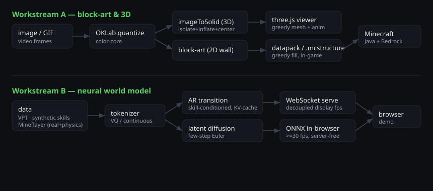
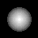

# Blockdream - technical writeup & results

A from-scratch system with two coupled halves: a real-time **image/video → Minecraft** engine and a
**neural world model** you can drive in the browser. This page backs the work with the architecture,
the methods that matter, graphics, and measured numbers. Deep dives:
[architecture](./architecture.md) · [3D & animation](./3d-and-animation.md) ·
[importing animations](./video-import.md) · [world models](./world-models-guide.md).

## System



Everything runs locally and open-source (the demo at `pnpm --filter web dev`). Block textures and
trained checkpoints are gitignored (Mojang assets / large artifacts), regenerated from documented
scripts.

## Image → 3D (the headline reconstruction)

The naive approach extrudes pixel **brightness** from one face: the background gets extruded, the
subject is never isolated, and it reads as a flat card when spun. `imageToSolid`
(`packages/voxel/src/depth.ts`) instead: (1) **isolates** the subject (border-connected background
flood-removed), (2) infers depth from **shape** - a 2D chamfer distance transform "inflates" the
silhouette into a rounded dome (a real depth map from a model or a Blender depth pass overrides it),
and (3) distributes thickness **symmetrically about the mid-plane** so the build is centered and
double-sided.

The depth maps below are projections of the reconstructed solid (brighter = thicker). A flat disc
becomes a rounded dome (front) with a lens cross-section (side) - a real centered body, not a card:

| front depth (dome) | side depth (lens) | real pixel-art |
|---|---|---|
|  |  |  |

**Accuracy is provable** (`packages/voxel/test/depth-accuracy.test.ts`): the front-view projection
reproduces every subject pixel's block exactly (colour + position), the silhouette equals the subject
mask, the background is air, and the side view is genuinely thick. Live WebGL rendering was validated
in a real browser (textured solid, spin + explode animations, zero 3D-path console errors).

## Blocks & rendering

The viewer greedy-meshes (`apps/web/src/mesh3d.ts`): interior/occluded faces are culled and coplanar
same-block faces merge into big quads - a solid N³ build drops from 6·N³ faces to **exactly 6**.
Per-face textures (grass top/side, log end-grain) come from the extracted block manifest. The same
voxel volumes export to a vanilla **datapack** (delta-encoded, greedy-fill optimized) or a Bedrock
**.mcstructure**, so what you see in the viewer is what the game places, block-for-block.

## World model

An autoregressive VQ-token model (MineWorld-style, KV-cached) trained on real VPT footage is served
over WebSocket; the display loop is decoupled from generation so it's always smooth. A latent-
diffusion track is exported to ONNX and runs **server-free in the browser** via `onnxruntime-web` -
the few-step Euler loop denoises the whole frame's latent in parallel, so frame rate is roughly
resolution-independent (the >=30fps route). Per-movement-type conditioning is proven on synthetic
per-skill data; the **Mineflayer collector** (`tools/mineflayer-collector`) gathers real per-skill
footage + physics telemetry - the comma.ai path - for photoreal *and* conditioned dynamics.

## Measured results

| area | result |
|---|---|
| JS/TS test suite | **249 passing** (52 files) |
| ML test suite | **83 passing** |
| Image→3D accuracy | front-view = source exactly; side max-depth ≫ 1 (real body) |
| Greedy mesh | solid N³ → 6 quads (interior fully culled) |
| Browser diffusion engine | exported ONNX runs few-step + decodes a valid frame at **~63 gen-fps** |
| Movement-type conditioning | all 9 types diverge (mean pairwise |Δframe| ≈ 0.022, verified) |
| Command-block export | emit-commands 66/66 + CLI 26/26 (incl. `voxel3d` animated datapack) |
| Rebrand | zero stray `@mineworld`/`mineworld_wm`/`world.mineworld`; MS "MineWorld" citations preserved |

## Reproduce

```bash
pnpm install && pnpm -r --filter "./packages/**" build
npx vitest run                 # JS/TS
node scripts/check-docs.mjs    # docs gate
cd ml && .venv/bin/python -m pytest   # ML
pnpm --filter web dev          # the demo on :5173
```
